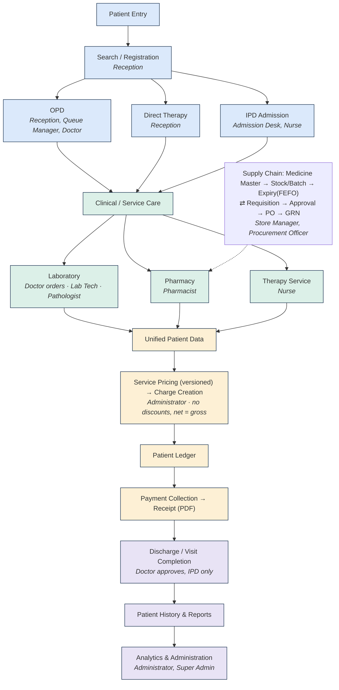

# 26 — End-to-End System Map (VERIFIED)

## Patient → care

```
PATIENT (Employee + HospitalUID + QR)
 ↓ REGISTRATION (verify → register → card)
 ↓ OPD (dept + TOKEN:<CODE>-NNN + OPD/YYYY/NNNNNN)
 ↓ CONSULTATION (Diagnosis + signed Prescription)
 ├── LAB (Order LAB/YYYY/NNNNN → Sample SYY-NNNNNNN → Result → Pathologist verify → REPORT → Doctor)
 ├── PHARMACY (signed queue → FEFO dispense → stock decrement → StockTransaction)
 ├── THERAPY (course [DIRECT|OPD|IPD] → sessions → Nurse perform → per-sitting charge)
 └── IPD (REQUESTED → resolve → ALLOCATED bed → ward notes/transfers → Doctor discharge → summary)
```

## Money (all billable activities converge)

```
SERVICE PRICING (catalogue + effective-dated versions)   [pharmacy: batch issue-price instead]
 ↓ CHARGE (ChargeItem PENDING, qty × rate, discount 0, cites servicePriceId)
 ↓ PATIENT LEDGER (per-employee aggregation)
 ↓ PAYMENT (Receipt RCPT/YYYY/NNNNNN, CASH|UPI|CARD)
 ↓ RECEIPT PDF (Puppeteer) → charges PAID
```

## Supply chain

```
INVENTORY (Medicine → Batch → PharmacyStock, FEFO-ordered, expiry-scanned)
 ↓ REQUISITION (StoreManager) ↓ APPROVAL (ProcurementOfficer/Admin)
 ↓ PO (gated on Approved) ↓ Supplier ↓ GRN (ONLY batch creator, verified)
 ↓ BATCH/STOCK ↓ transfer ↓ PHARMACY ↓ DISPENSING (→ StockTransaction + charge)
```

Each arrow resolves to a controller → service → model in §§07–15 and paths in §17.
Unmapped integrations (gateway, devices, S3, BullMQ, Sentry) are NOT VERIFIED present.

## One-page visual (same facts as above, Mermaid)

Added for onboarding/management — this is a rendering of the exact same verified
flow above (Patient → Care, Money, Supply chain), not a new source of truth.
Role tags are per `PERMISSION_GRANTS` in `apps/api/prisma/seed.ts`. Ward tier is
deliberately left generic ("Bed / Ward Allocation") rather than naming a specific
room class — pricing/eligibility detail lives in `FacilityEligibilityRule`, not here.


